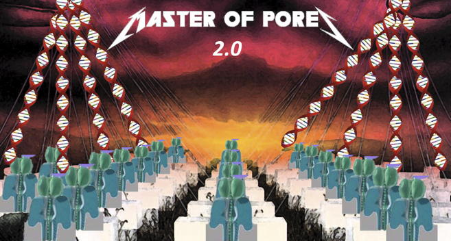

.. _home-page-index:

*******************
Welcome to the documentation of Master Of Pores
*******************

.. autosummary::
   :toctree: generated

Master of Pores is a pipeline writte in Nextflow DSL2 for the analysis of Nanopore data. It can handle reads from direct RNAseq, cDNAseq, DNAseq etc.

.. MoP2 documentation master file, created by
   Luca Cozzuto.
   You can adapt this file completely to your liking, but it should at least
   contain the root `toctree` directive.

Contents:

.. toctree::
   :maxdepth: 1

   about
   install

