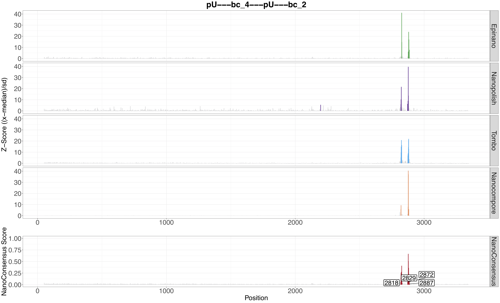

.. _home-page-mopconsensus:

*******************
MOP_CONSENSUS
*******************

.. autosummary::
   :toctree: generated

This module takes as input the output from MOP_MOD with all the four worklows. It outputs the consensus of the diferent predictions running the tool `Nanoconsensus <https://github.com/ADelgadoT/NanoConsensus>`__ in parallel on each transcript for each comparison. 

Here an example of a result:

