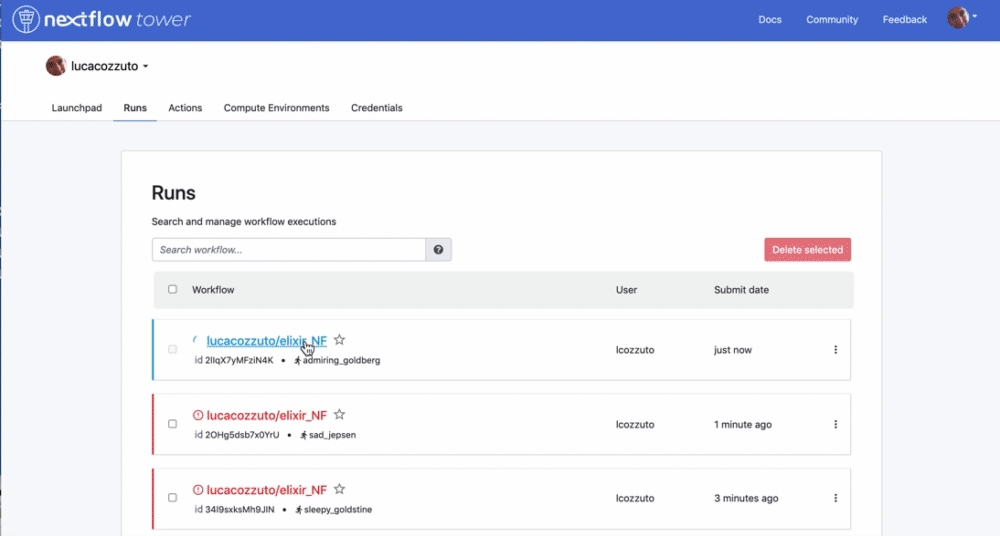

.. _home-page-reporting:

**************
Resource reporting
**************

.. autosummary::
   :toctree: generated

Since each MOP pipeline is based on `Nextflow <https://www.nextflow.io/>`_ we can use its embedded functions for reporting the use of resources as a html file and to have a live reporting.

Html report
====================

For enabling the generation of a report just run each pipeline with the parameter `-with-report` as in the following example:

.. code-block:: console

  nextflow run mop_preprocess.nf -profile local -with-docker -bg -with-report

Once the pipeline is finished you will have a comprehensive report with information about CPU, disk and memory usage for each execution and as a distribution for each process. Here an example:

.. image:: ../img/res_report.png
  :width: 800  
  

Live reporting
====================

For having a live reporting your pipeline should run in an environment that has access to internet. Then you have to log-in to the `Tower.nf <https://tower.nf/>`_  website that is developed and mantained by the good people at `Seqera Labs <https://seqera.io/>`__. 

.. image:: ../img/tower.png
  :width: 800  
  

We suggest you to use either the GitHub or the Google authentication:

You can generate your token at `https://tower.nf/tokens <https://tower.nf/tokens>`__ and

.. image:: ../img/tower2.png
  :width: 800 

then you can export as an environmental variable.

.. code-block:: console

  export TOWER_ACCESS_TOKEN=*******YOUR***TOKEN*****HERE*******

.. tip::
  We recommend you to add this line to either your .bashrc or .bash_profile file. 
  
Finally we can then launch the pipeline adding the parameter `-with-tower`.

.. code-block:: console

  nextflow run mop_preprocess.nf -profile local -with-docker -bg -with-tower

Going back to the website you can see now your pipeline running and have a nice looking live reporting.

